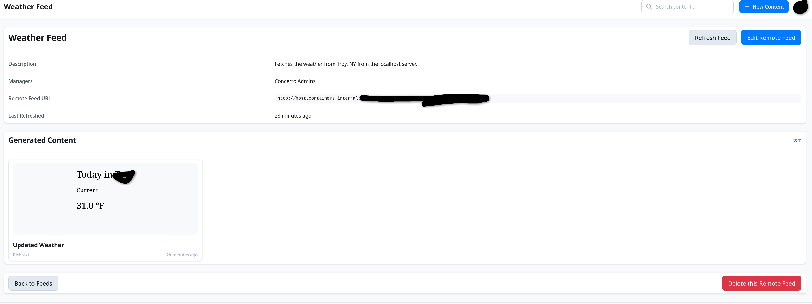

# Day 7: The final weather update

So I a weather feed that fetches to the url I specified in the last update.
However, while I can fetch it from the server cli, the concerto server seems
to find difficulty in doing that.

I checked the weather feed server logs and figured out that the requests from
the docker concerto weren't even being logged in the server.
I then entered into the docker container with a shell and figured out (by
curling the server) that docker is blocking connections to localhost from
inside the container.

I thought I could fix it through slirp4netns with allow_host_loopback but I
couldn't find a way to access the server since it was listening on only
`127.0.0.1`.

I'll bind it to `0.0.0.0` instead and hope that the firewall is configured to
deny traffic to it. Then I can get Concerto Docker to fetch from `host.containers.internal`
and succeed.

In completion, I managed to do it! The weather is now fetched by concerto as shown:

I also switched around the ticker and the sidebar so that the Amos Eaton feed shows the welcome.

I also figured out that parenthesis was bugging the concerto images and prevented
them from displaying. However, the backend seems to serve the images just fine so
the actual problem is just the frontend code.

The weather however is not showing in the actual feed so I [dumped](./weather_html_dump.txt)
an example of the prior html in an attempt to replicate it.
